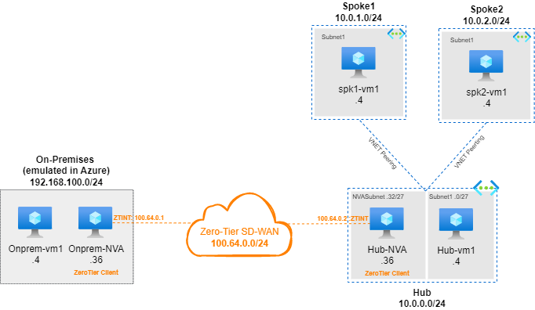

# Scenarios using ZeroTier SD-WAN in Azure

### What is ZeroTier

ZeroTier is an open-source software-defined networking platform that enables secure and seamless connectivity between devices, regardless of their physical location, using a virtual network overlay.

**How it Works:**
1. Devices install the ZeroTier client and join virtual networks by sharing their unique Node ID.
2. ZeroTier creates a virtual overlay network, assigning each device an IP address.
3. Devices can communicate directly within the network, enabling seamless data exchange.

**Reference:** [ZeroTier Official Website](https://www.zerotier.com/)

The goal of this repository is to show some practical use cases of ZeroTier using Azure Networking.

### ZeroTier Lab requirements

Before proceeding with any lab, make sure you have an account in ZeroTier to provision the SD-WAN network required for this Lab.
Go to [https://my.zerotier.com/](https://my.zerotier.com/). Ensure you have your Network ID.

### Scenario 1: On-Premises to Hub and Spoke (static routing)

- Deployment script [1-deploy.azcl](./Scenario1/1-deploy.azcli)
- Replace the following parameters. 
```Bash
#Parameters
rg=lab-zt-sdwan #Define your resource group
location=centralus #Set location
virtualMachineSize=Standard_DS1_v2 #Set VM size
username=azureuser #Set username
password=Msft123Msft123 #Set password
```
- Enter your ZeroTier network ID (when prompted):

```Bash
# Create a promp command to ask for ZeroTier network ID
read -p "Enter your ZeroTier network ID: " zerotiernetid
```

- You can use dynamic IP assignment but for this Lab I will be using static to help understand the traffic flow. Please use, [this reference](./Scenario1/1-zerotier.md)
- Reference Network diagram:


###  Scenario 2: On-Premises to Azure Hub and Spoke (Dynamic Routing using BGP)

Coming soon...