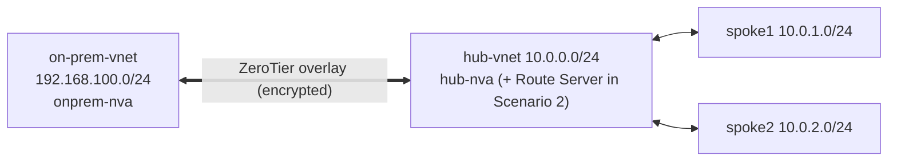

# Azure ZeroTier SD‑WAN Lab

Practical, deploy‑it‑yourself labs that connect a simulated **on‑premises** site
to an Azure **hub‑and‑spoke** network over an encrypted
[ZeroTier](https://www.zerotier.com/) overlay — first with **static routing**,
then with **dynamic BGP** via **Azure Route Server**.

Everything is **Bicep** (declarative IaC) with thin `bash` wrappers that prompt
for inputs — nothing is hardcoded and there are no external template
dependencies.

## What is ZeroTier?

ZeroTier is an open‑source, software‑defined networking platform that builds a
secure virtual **overlay** between devices regardless of where they sit. Each
node installs the client, joins a network by its **Network ID**, and gets an
overlay IP — traffic between members is encrypted end‑to‑end. In these labs two
Linux **NVAs** join the same ZeroTier network to form the site‑to‑site tunnel.

## Scenarios

| | Scenario | Routing | Key Azure service | Diagram |
| --- | --- | --- | --- | --- |
| 1️⃣ | [**Static routing**](./scenario1-static-routing/README.md) | User‑defined routes (UDRs) | — | [view](./scenario1-static-routing/README.md#network-diagram) |
| 2️⃣ | [**Dynamic BGP routing**](./scenario2-dynamic-bgp/README.md) | BGP (FRR) auto‑propagation | **Azure Route Server** | [view](./scenario2-dynamic-bgp/README.md#network-diagram) |


```mermaid
flowchart LR
    OP["on‑prem‑vnet<br/>192.168.100.0/24<br/>onprem-nva"]
    HUB["hub‑vnet 10.0.0.0/24<br/>hub-nva (+ Route Server in Scenario 2)"]
    S1["spoke1 10.0.1.0/24"]
    S2["spoke2 10.0.2.0/24"]
    OP <==>|"ZeroTier overlay (encrypted)"| HUB
    HUB <--> S1
    HUB <--> S2
```

Both scenarios share the same topology (hub + two spokes + on‑prem, joined by
ZeroTier). The **only** difference is how routes are distributed:

* **Scenario 1** — you write static UDRs (`RFC1918 → NVA`). Deterministic and
  dependency‑free; a great starting point.
* **Scenario 2** — Azure Route Server + FRR speak BGP, so prefixes propagate
  automatically and the Azure‑side UDRs disappear. Closer to production SD‑WAN.

## Repository layout

```
azure-zt-lab/
├── modules/                  # reusable Bicep modules (vnet, nsg, linux-vm,
│                             #   route-table, vnet-peering, route-server)
├── scripts/                  # cloud-init for NVAs + workload VMs, samples
├── docs/
│   ├── zerotier-setup.md     # create the ZeroTier network + authorize members
│   └── images/               # diagrams + screenshots
├── scenario1-static-routing/ # main.bicep · deploy.sh · cleanup.sh · README
└── scenario2-dynamic-bgp/    # main.bicep · deploy.sh · apply-frr.sh · cleanup.sh · frr/ · README
```

## Prerequisites

Everything runs from [Azure Cloud Shell](https://shell.azure.com) (bash), which
already has the Azure CLI, Bicep, `jq`, `curl`, `base64`, and an SSH client. To
run locally instead, install:

| Requirement | Notes |
| --- | --- |
| Azure subscription + [Azure CLI](https://learn.microsoft.com/cli/azure/install-azure-cli) | run `az login` first |
| [Bicep](https://learn.microsoft.com/azure/azure-resource-manager/bicep/install) | bundled with a recent `az` |
| **ZeroTier** account, network, and **API token** | follow [docs/zerotier-setup.md](./docs/zerotier-setup.md); keep your **Network ID** handy |
| `bash`, `curl`, `base64`, `jq` | `jq` is required by the ZeroTier API automation |
| OpenSSH client | for the SSH verification steps |

## Quick start

```bash
# 1. Set up your ZeroTier network + API token (once) — see docs/zerotier-setup.md
export ZEROTIER_API_TOKEN="<your-token>"   # enables hands-free member authorization

# 2. Pick a scenario and deploy:
cd scenario1-static-routing        # or scenario2-dynamic-bgp
./deploy.sh                        # prompts for creds + ZeroTier Network ID,
                                   # then authorizes both NVAs via the API

# 3. Scenario 2 only — bring up BGP:
#    ./apply-frr.sh               # auto-reads the pinned overlay IPs

# 4. Verify, then tear down (see the scenario README):
./cleanup.sh
```

> Member authorization is **automatic** when `ZEROTIER_API_TOKEN` is set (or
> pasted at the prompt). Skip the token to fall back to authorizing the two NVAs
> manually in the portal.

Each scenario README has its own diagram, address plan, verification commands,
and teardown steps.

## Cost & cleanup

These labs create real, billable resources (six small Ubuntu VMs, public IPs,
and — in Scenario 2 — an **Azure Route Server**, billed hourly). Always run the
scenario's `./cleanup.sh` when you're done, and remove the NVAs from your
ZeroTier network in the portal.

## References

* [ZeroTier](https://www.zerotier.com/) · [Manage portal](https://my.zerotier.com/)
* [Azure Route Server](https://learn.microsoft.com/azure/route-server/overview)
* [FRRouting](https://frrouting.org/)
* [Bicep](https://learn.microsoft.com/azure/azure-resource-manager/bicep/)
