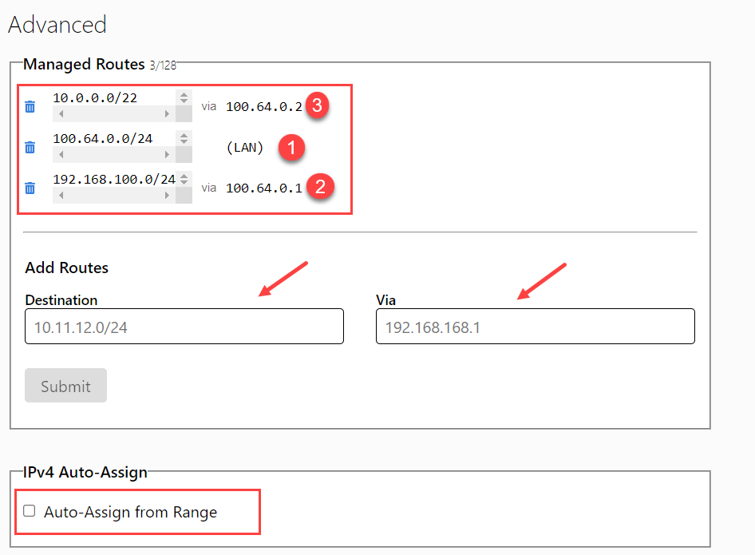
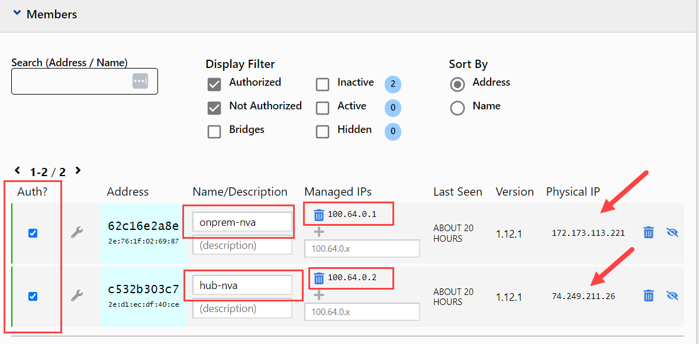
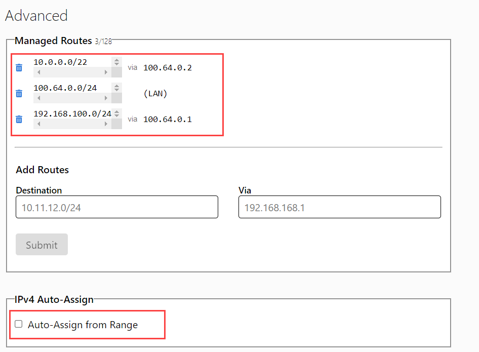

# ZeroTier setup

[ZeroTier](https://www.zerotier.com/) provides the encrypted overlay network that
connects the **hub-nva** (Azure) and **onprem-nva** (simulated on‑premises) in both
lab scenarios. This guide creates a network and explains automatic member
authorization plus the manual portal fallback.

## 1. Create a free account and a network

1. Sign up at [my.zerotier.com](https://my.zerotier.com/).
2. Go to **Networks → Create A Network**.
3. Open the network and note its **Network ID** (16 hex characters). You supply
   this to `deploy.sh` at deploy time.

## 2. Recommended network configuration

In the network's settings page:

| Setting | Value | Why |
| --- | --- | --- |
| Access Control | **Private** | Members must be authorized before they can join — safer for a lab. |
| IPv4 Auto‑Assign | Enable a range, e.g. `172.27.0.0/24` | Gives each NVA an overlay IP. This range is deliberately **outside** the Azure (`10.0.0.0/16`) and on‑prem (`192.168.100.0/24`) spaces so overlay traffic is never caught by the site UDRs/BGP routes. |
| Managed Routes | Add `172.27.0.0/24` (the auto‑assign range) | Required if you pin IPs via the API — a pinned address must fall inside a managed route. |





> **Overlay IP plan used throughout the labs**
>
> | Node | Overlay IP |
> | --- | --- |
> | `hub-nva` | `172.27.0.10` |
> | `onprem-nva` | `172.27.0.20` |
>
> These are the defaults `deploy.sh` pins automatically (see §3a). Keeping them
> fixed makes the Scenario 2 FRR/BGP config deterministic.

## 3. Authorize the NVAs (post‑deploy)

`deploy.sh` installs ZeroTier on **hub-nva** and **onprem-nva** and joins them to
your network. Because the network is **Private**, they appear as *unauthorized*
members until you approve them. You can do this **automatically via an API token**
(recommended, §3a) or **manually in the portal** (§3b).

### 3a. Automated authorization via API token (recommended)

`deploy.sh` can authorize both members and pin their overlay IPs through the
**Legacy Central API v1** using a token created according to the current
[ZeroTier token guidance](https://docs.zerotier.com/tokens/):

1. Create a token at [my.zerotier.com](https://my.zerotier.com/) →
   **Account → API Access Tokens → New Token**. Copy it once (it is shown only once).
2. Make it available to `deploy.sh` in either way:
   ```bash
   export ZEROTIER_API_TOKEN="<your-token>"   # env var, or…
   ```
   …just leave it unset and paste it at the (hidden) prompt during deploy.
3. `deploy.sh` then resolves each NVA's node ID, calls
   `POST /network/{networkId}/member/{nodeId}` to set `authorized:true` and pin the
   overlay IP, and records the results in a gitignored `.zt-overlay.env`.

**Prerequisites for this path:** `curl` and `jq` on the machine running `deploy.sh`,
and a **Managed Route** covering the pinned IPs (see the table above). The token is
never echoed or committed. If you press Enter to skip the token, deploy falls back
to the manual steps below.

> ZeroTier's New Central API v2 uses service accounts and plan-dependent
> features. These labs intentionally retain Legacy Central API v1 so free and
> legacy users can follow the same workflow. Do not use a New Central service
> account token with `scripts/zt-api.sh`.

> You can also run the helper standalone:
> ```bash
> ZEROTIER_API_TOKEN=... ./scripts/zt-api.sh <networkId> <nodeId> hub-nva 172.27.0.10
> ```

### 3b. Manual authorization in the portal (fallback)

1. Open your network at [my.zerotier.com](https://my.zerotier.com/).
2. Under **Members**, tick **Auth?** for the two new nodes.
3. Assign each an overlay IP — pin `172.27.0.10` (hub-nva) and `172.27.0.20`
   (onprem-nva) so the addresses stay stable across reboots.



> Tip: identify which member is which by running `sudo zerotier-cli info` /
> `sudo zerotier-cli listnetworks` on each NVA (the node ID is shown in both).

## 4. Verify the overlay

Use Azure Run Command, or SSH to each NVA through its source-restricted public
IP, and confirm the tunnel is up:

```bash
sudo zerotier-cli listnetworks      # STATUS should be OK
ip addr show zt+                    # overlay interface + assigned IP
ping <other-nva-overlay-ip>         # end-to-end across the overlay
```

Once both NVAs can ping each other over the overlay, return to the scenario
README to finish routing configuration and run the connectivity tests.