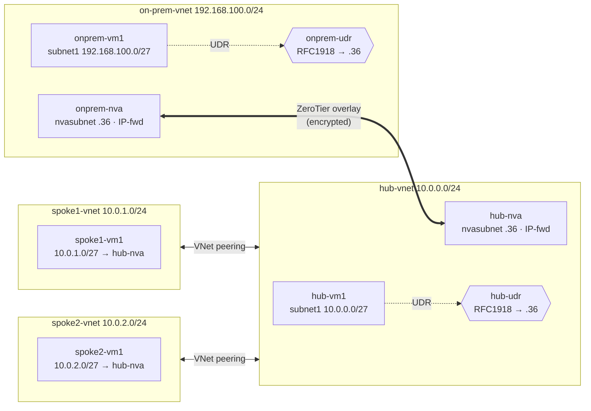

# Scenario 1 — On‑premises to Azure over ZeroTier (static routing)

Connect a simulated **on‑premises** site to an Azure **hub‑and‑spoke** network
through an encrypted [ZeroTier](https://www.zerotier.com/) overlay, using two
Linux **network virtual appliances (NVAs)** and **static user‑defined routes
(UDRs)**.

This is the classic, dependency‑free pattern: routing is explicit and
deterministic. For the dynamic/BGP equivalent, see
[Scenario 2](../scenario2-dynamic-bgp/README.md).

## Network diagram



| VNet | Address space | Subnets | Notes |
| --- | --- | --- | --- |
| hub‑vnet | `10.0.0.0/24` | `subnet1` `10.0.0.0/27`, `nvasubnet` `10.0.0.32/27` | hub‑nva at `10.0.0.36` |
| spoke1‑vnet | `10.0.1.0/24` | `subnet1` `10.0.1.0/27` | peered to hub |
| spoke2‑vnet | `10.0.2.0/24` | `subnet1` `10.0.2.0/27` | peered to hub |
| onprem‑vnet | `192.168.100.0/24` | `subnet1` `192.168.100.0/27`, `nvasubnet` `192.168.100.32/27` | onprem‑nva at `192.168.100.36` |

### How traffic flows

* **Spoke ↔ on‑prem:** `spoke1-vm1 → hub-nva` (spoke UDR) → **ZeroTier overlay** →
  `onprem-nva → onprem-vm1` (on‑prem UDR).
* **Hub ↔ on‑prem:** `hub-vm1 → hub-nva` → overlay → `onprem-nva → onprem-vm1`.
* **Intra‑Azure (hub ↔ spoke):** direct via **VNet peering** — the more‑specific
  system route wins over the `10.0.0.0/8` UDR, so hub/spoke traffic never
  needlessly hairpins through the NVA.
* NVAs use **static private IPs** so the UDR next‑hops are deterministic, and
  have **IP forwarding** enabled on the NIC.

## Prerequisites

* An Azure subscription and the [Azure CLI](https://learn.microsoft.com/cli/azure/install-azure-cli) (`az login`).
* [Bicep](https://learn.microsoft.com/azure/azure-resource-manager/bicep/install) (bundled with recent `az`).
* A ZeroTier network — see [../docs/zerotier-setup.md](../docs/zerotier-setup.md). Have your **Network ID** ready.
* `bash`, `curl`, and `base64` (Azure Cloud Shell has all three).

## Deploy

```bash
cd scenario1-static-routing
./deploy.sh
```

`deploy.sh` will:

1. Prompt for resource group, region, VM size, **admin username/password**, and
   your **ZeroTier Network ID** (nothing is hardcoded).
2. Lock SSH to your current public IP (auto‑detected, override‑able).
3. Base64‑encode the cloud‑init files and deploy `main.bicep`.
4. Install ZeroTier on both NVAs and join them to your network.

Then finish the **manual ZeroTier step**: authorize `hub-nva` and `onprem-nva`
in the portal and note their overlay IPs
(see [../docs/zerotier-setup.md](../docs/zerotier-setup.md)).

## Verify

```bash
# On each NVA (SSH via its public IP from the deployment outputs):
sudo zerotier-cli listnetworks          # STATUS = OK
ping <other-nva-overlay-ip>             # NVAs reachable across the overlay

# End-to-end (SSH to onprem-vm1, ping a spoke workload):
ping 10.0.1.4                            # onprem-vm1 -> spoke1-vm1
curl http://10.0.2.4                     # onprem-vm1 -> spoke2-vm1 (nginx returns hostname)

# Confirm the UDRs are programmed on a spoke NIC:
az network nic show-effective-route-table -g <rg> -n spoke1-vm1-nic \
  --query "value[?nextHopType=='VirtualAppliance'].[addressPrefix[0], nextHopIpAddress[0]]" -o tsv
# Expect: 10.0.0.0/8, 172.16.0.0/12, 192.168.0.0/16  all -> 10.0.0.36
```

## What gets deployed

| Type | Resources |
| --- | --- |
| VNets | hub, spoke1, spoke2, onprem (+ subnets) |
| NSGs | `default-nsg` (SSH from your IP), `nva-nsg` (RFC1918 + SSH) |
| Route tables | hub‑udr, spoke1‑udr, spoke2‑udr, onprem‑udr |
| NVAs | `hub-nva`, `onprem-nva` (IP‑fwd, static IP, public IP) |
| VMs | `hub-vm1`, `spoke1-vm1`, `spoke2-vm1`, `onprem-vm1` |
| Peerings | spoke1 ↔ hub, spoke2 ↔ hub |

## Clean up

```bash
./cleanup.sh          # deletes the resource group
```

Also remove `hub-nva` / `onprem-nva` from your ZeroTier network in the portal.

> **Cost:** six small Ubuntu VMs plus public IPs. Delete the resource group when
> you're done to avoid ongoing charges.
