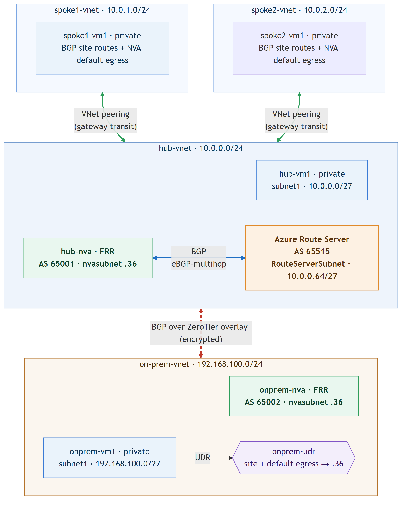

# Scenario 2 — On‑premises to Azure over ZeroTier (dynamic BGP routing)

Connect a simulated **on‑premises** site to an Azure **hub‑and‑spoke** network
through an encrypted [ZeroTier](https://www.zerotier.com/) overlay — but instead
of static routes, let **BGP** distribute prefixes automatically using
[**Azure Route Server**](https://learn.microsoft.com/azure/route-server/overview)
and [**FRR**](https://frrouting.org/) on the NVAs.

Routes propagate on their own: advertise the on‑prem LAN once and every Azure
VM learns it; Azure VNet prefixes flow back to on‑prem the same way. No static
**site-prefix** UDRs are maintained on the Azure side; default routes still
provide explicit NVA egress. For the static equivalent, see
[Scenario 1](../scenario1-static-routing/README.md).

## End‑to‑end walkthrough

1. **Deploy** the infrastructure incl. Azure Route Server — `./deploy.sh` (~20 min).
2. **Authorize** the two NVAs on the ZeroTier network — automatic when you supply
   an API token, otherwise manual in the portal.
3. **Bring up BGP** — `./apply-frr.sh` (auto‑reads the pinned overlay IPs).
4. **Verify** learned routes (`vtysh`, Route Server, effective routes on a spoke).
5. **Clean up** — `./cleanup.sh`.

Overlay IP plan (pinned automatically by `deploy.sh`, consumed by `apply-frr.sh`):

| Node | Overlay IP |
| --- | --- |
| `hub-nva` | `172.27.0.10` |
| `onprem-nva` | `172.27.0.20` |

## Network diagram



Editable source: [`scenario2-diagram.mmd`](../docs/images/scenario2-diagram.mmd)

| VNet | Address space | Subnets | Notes |
| --- | --- | --- | --- |
| hub‑vnet | `10.0.0.0/24` | `subnet1` `10.0.0.0/27`, `nvasubnet` `10.0.0.32/27`, `RouteServerSubnet` `10.0.0.64/27` | hub‑nva `10.0.0.36`; Route Server in its own subnet |
| spoke1‑vnet | `10.0.1.0/24` | `subnet1` `10.0.1.0/27` | peered to hub, `useRemoteGateways` |
| spoke2‑vnet | `10.0.2.0/24` | `subnet1` `10.0.2.0/27` | peered to hub, `useRemoteGateways` |
| onprem‑vnet | `192.168.100.0/24` | `subnet1` `192.168.100.0/27`, `nvasubnet` `192.168.100.32/27` | onprem‑nva `192.168.100.36` |

### AS numbers

| Speaker | ASN | Role |
| --- | --- | --- |
| Azure Route Server | `65515` | fixed by Azure; injects learned routes into the VNet data plane |
| hub‑nva (FRR) | `65001` | eBGP transit — peers Route Server **and** onprem‑nva |
| onprem‑nva (FRR) | `65002` | customer edge — advertises `192.168.100.0/24` |

### How routes propagate

1. **onprem‑nva** advertises `192.168.100.0/24` over the ZeroTier overlay to
   **hub‑nva** (eBGP, AS 65002 → 65001).
2. **hub‑nva** re‑advertises it to **Azure Route Server** (AS 65001 → 65515).
   Route Server programs it into the hub **and every peered spoke** VNet.
3. In reverse, Route Server hands the approved Azure VNet prefixes
   (`10.0.0.0/24`, `10.0.1.0/24`, `10.0.2.0/24`) to hub‑nva, which relays them
   to onprem‑nva. The on-prem workload needs only its edge UDR; remote site
   prefixes are learned by the NVA through BGP.
4. Spokes receive the injected routes because the hub↔spoke peerings enable
   **gateway transit** (hub side `allowGatewayTransit`, spoke side
   `useRemoteGateways`).

> **Why the on‑prem side still has a UDR:** there is no Route Server on‑premises,
> so `onprem-udr` statically points its workload subnet at `onprem-nva`. That NVA
> is where BGP takes over. This mirrors a real customer edge.

> **eBGP‑multihop:** the Route Server lives in a different subnet than the NVA, so
> hub‑nva peers it with `ebgp-multihop 2`.

> **Route safety:** FRR prefix lists permit only the three documented Azure
> `/24` prefixes toward on-premises and only `192.168.100.0/24` toward Azure.
> The on-premises aggregate is backed by a high-distance Null0 route so FRR can
> originate it deterministically. A more-specific route through Azure's
> first-hop router preserves reachability to the on-premises workload `/27`.

## Prerequisites

* An Azure subscription and the [Azure CLI](https://learn.microsoft.com/cli/azure/install-azure-cli) (`az login`).
* [Bicep](https://learn.microsoft.com/azure/azure-resource-manager/bicep/install) (bundled with recent `az`).
* A ZeroTier network and optional **Legacy Central API token** — see [../docs/zerotier-setup.md](../docs/zerotier-setup.md). Have your **Network ID** ready.
* `bash`, `curl`, `base64`, and `jq` (Cloud Shell has all four; `jq` is used by the authorization automation).
* An **OpenSSH client** and SSH public key (`ssh-keygen -t ed25519`).

## Deploy

```bash
cd scenario2-dynamic-bgp
export ZEROTIER_API_TOKEN="<your-token>"   # optional; enables auto-authorization
./deploy.sh
```

`deploy.sh` will:

1. Prompt for resource group, region, VM size, admin username, **SSH public
   key**, allowed SSH source, and your **ZeroTier Network ID**.
2. Build Bicep, validate the ARM deployment, display `what-if`, and deploy,
   including the
   **Azure Route Server** — the whole deploy takes **~20 min** (Route Server alone
   adds ~15 min).
3. Wait for cloud-init, install ZeroTier on both NVAs, and join the network.
4. **Authorize both NVAs and pin their overlay IPs** (`172.27.0.10` / `172.27.0.20`)
   via the ZeroTier API when a token is available — otherwise it prints the manual
   portal steps — and writes the resolved IPs to `.zt-overlay.env`.

The exact Azure deployment is recorded in `.deployment.env`; `apply-frr.sh`
uses that state rather than guessing from deployment history. For repeatable
runs, use `./deploy.sh --help`. If authorization is left manual, `deploy.sh`
exits with status `2` to indicate that BGP configuration is pending.

## Bring up BGP

```bash
./apply-frr.sh
```

It auto‑reads the pinned overlay IPs from `.zt-overlay.env` (prompting only as a
fallback), reads the Route Server IPs from the deployment outputs, renders the FRR
templates in [`frr/`](./frr), tests each candidate configuration before
installing it, restarts FRR, and waits for all sessions and required prefixes.

## Verify

```bash
# FRR state on the NVAs:
az vm run-command invoke -g <rg> -n hub-nva --command-id RunShellScript \
  --scripts "sudo vtysh -c 'show ip bgp summary'; sudo vtysh -c 'show ip bgp'"
az vm run-command invoke -g <rg> -n onprem-nva --command-id RunShellScript \
  --scripts "sudo vtysh -c 'show ip bgp summary'; sudo vtysh -c 'show ip bgp'"

# From onprem-nva you should see 10.0.0.0/24, 10.0.1.0/24, 10.0.2.0/24.
# From hub-nva you should see 192.168.100.0/24.

# What Azure Route Server learned from / advertises to the hub NVA:
az network routeserver peering list-learned-routes \
  --routeserver hub-route-server -g <rg> --name hub-nva -o table
az network routeserver peering list-advertised-routes \
  --routeserver hub-route-server -g <rg> --name hub-nva -o table

# Effective routes on a spoke NIC — the on-prem prefix now appears with
# origin "VirtualNetworkGateway"/BGP (NOT a static UDR):
az network nic show-effective-route-table -g <rg> -n spoke1-vm1-nic \
  --query "value[?contains(addressPrefix[0],'192.168')].[addressPrefix[0], nextHopType]" -o tsv

# Bidirectional end-to-end tests from private workloads:
az vm run-command invoke -g <rg> -n onprem-vm1 --command-id RunShellScript \
  --scripts "ping -c 4 10.0.1.4; curl --fail http://10.0.2.4"
az vm run-command invoke -g <rg> -n spoke1-vm1 --command-id RunShellScript \
  --scripts "ping -c 4 192.168.100.4; curl --fail http://192.168.100.4"
```

## What gets deployed

| Type | Resources |
| --- | --- |
| VNets | hub (+ `RouteServerSubnet`), spoke1, spoke2, onprem |
| NSGs | `default-nsg` for private workloads; `nva-nsg` for RFC1918 forwarding and source-restricted SSH |
| Route tables | `onprem-udr` for the simulated edge; hub/spoke UDRs contain only explicit default egress |
| Route Server | `hub-route-server` (Standard) peering `hub-nva` |
| NVAs | `hub-nva` (AS 65001), `onprem-nva` (AS 65002) — FRR, IP‑fwd, static IP |
| VMs | four private-only workload VMs |
| Peerings | spoke1 ↔ hub, spoke2 ↔ hub (gateway transit) |

## Clean up

```bash
./cleanup.sh          # confirms resource-group deletion and optional member removal
./cleanup.sh --wait   # wait until Azure confirms deletion
```

> **Cost:** six small Ubuntu VMs, managed disks, two NVA public IPs, **and an Azure Route Server**
> (billed hourly while it exists). Delete the resource group when you're done to
> avoid ongoing charges — the Route Server is the most expensive piece.

## Troubleshooting

| Symptom | Check |
| --- | --- |
| Route Server deployment is slow | Provisioning commonly takes 15-20 minutes; inspect `az deployment group show -g <rg> -n <deployment>`. |
| FRR rejects a candidate config | Review the `frr-reload.py --test` output; the previous running configuration remains installed. |
| A BGP session does not establish | Check both ZeroTier addresses, TCP/179 reachability, local ASNs, Route Server peer IPs, and `sudo vtysh -c "show ip bgp summary"`. |
| Route Server sessions establish but received prefixes are invalid | Confirm `ip nht resolve-via-default` is present on `hub-nva`; FRR needs it to resolve the multihop Route Server next hops through Azure's virtual router. |
| Prefix is absent in a spoke | Confirm FRR route maps, Route Server learned routes, peering gateway transit, and the spoke effective route table. |
