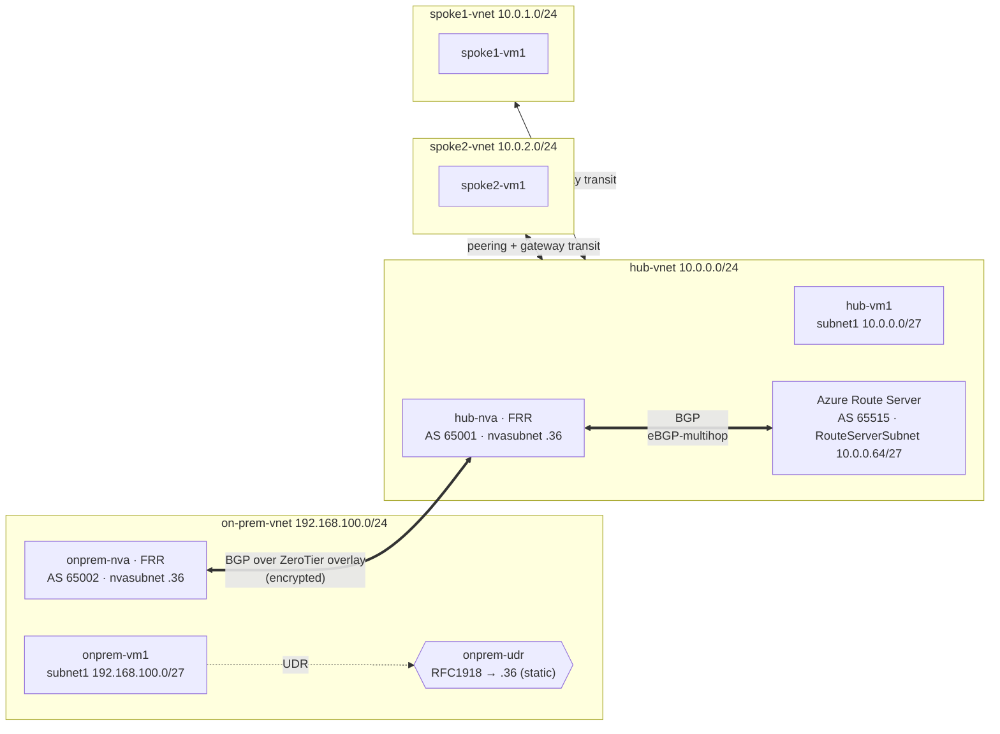

# Scenario 2 — On‑premises to Azure over ZeroTier (dynamic BGP routing)

Connect a simulated **on‑premises** site to an Azure **hub‑and‑spoke** network
through an encrypted [ZeroTier](https://www.zerotier.com/) overlay — but instead
of static routes, let **BGP** distribute prefixes automatically using
[**Azure Route Server**](https://learn.microsoft.com/azure/route-server/overview)
and [**FRR**](https://frrouting.org/) on the NVAs.

Routes propagate on their own: advertise the on‑prem LAN once and every Azure
VM learns it; Azure VNet prefixes flow back to on‑prem the same way. No UDRs to
maintain on the Azure side. For the static equivalent, see
[Scenario 1](../scenario1-static-routing/README.md).

## Network diagram



| VNet | Address space | Subnets | Notes |
| --- | --- | --- | --- |
| hub‑vnet | `10.0.0.0/24` | `subnet1` `10.0.0.0/27`, `nvasubnet` `10.0.0.32/27`, `RouteServerSubnet` `10.0.0.64/27` | hub‑nva `10.0.0.36`; Route Server in its own subnet |
| spoke1‑vnet | `10.0.1.0/24` | `subnet1` `10.0.1.0/27` | peered to hub, `useRemoteGateways` |
| spoke2‑vnet | `10.0.2.0/24` | `subnet1` `10.0.2.0/27` | peered to hub, `useRemoteGateways` |
| onprem‑vnet | `192.168.100.0/24` | `subnet1` `192.168.100.0/27`, `nvasubnet` `192.168.100.32/27` | onprem‑nva `192.168.100.36` |

### AS numbers

| Speaker | ASN | Role |
| --- | --- | --- |
| Azure Route Server | `65515` | fixed by Azure; injects learned routes into the VNet data plane |
| hub‑nva (FRR) | `65001` | eBGP transit — peers Route Server **and** onprem‑nva |
| onprem‑nva (FRR) | `65002` | customer edge — advertises `192.168.100.0/24` |

### How routes propagate

1. **onprem‑nva** advertises `192.168.100.0/24` over the ZeroTier overlay to
   **hub‑nva** (eBGP, AS 65002 → 65001).
2. **hub‑nva** re‑advertises it to **Azure Route Server** (AS 65001 → 65515).
   Route Server programs it into the hub **and every peered spoke** VNet.
3. In reverse, Route Server hands the Azure VNet prefixes
   (`10.0.0.0/24`, `10.0.1.0/24`, `10.0.2.0/24`) to hub‑nva, which relays them
   to onprem‑nva. On‑prem VMs reach Azure with **zero static routes**.
4. Spokes receive the injected routes because the hub↔spoke peerings enable
   **gateway transit** (hub side `allowGatewayTransit`, spoke side
   `useRemoteGateways`).

> **Why the on‑prem side still has a UDR:** there is no Route Server on‑premises,
> so `onprem-udr` statically points its workload subnet at `onprem-nva`. That NVA
> is where BGP takes over. This mirrors a real customer edge.

> **eBGP‑multihop:** the Route Server lives in a different subnet than the NVA, so
> hub‑nva peers it with `ebgp-multihop 2`.

## Prerequisites

* An Azure subscription and the [Azure CLI](https://learn.microsoft.com/cli/azure/install-azure-cli) (`az login`).
* [Bicep](https://learn.microsoft.com/azure/azure-resource-manager/bicep/install) (bundled with recent `az`).
* A ZeroTier network — see [../docs/zerotier-setup.md](../docs/zerotier-setup.md). Have your **Network ID** ready.
* `bash`, `curl`, and `base64` (Azure Cloud Shell has all three).

## Deploy

```bash
cd scenario2-dynamic-bgp
./deploy.sh
```

`deploy.sh` will:

1. Prompt for resource group, region, VM size, **admin username/password**, and
   your **ZeroTier Network ID** (nothing is hardcoded).
2. Base64‑encode the cloud‑init files and deploy `main.bicep`, including the
   **Azure Route Server** (this step adds ~15–20 min).
3. Install ZeroTier on both NVAs and join them to your network.

Then finish the **manual ZeroTier step**: authorize `hub-nva` and `onprem-nva`
in the portal and note their overlay IPs
(see [../docs/zerotier-setup.md](../docs/zerotier-setup.md)).

## Bring up BGP

Once both NVAs have overlay IPs:

```bash
./apply-frr.sh
```

It reads the Route Server IPs from the deployment outputs, renders the FRR
templates in [`frr/`](./frr), enables `bgpd`, and restarts FRR on each NVA.

## Verify

```bash
# On each NVA (SSH via its public IP from the deployment outputs):
sudo vtysh -c "show ip bgp summary"      # sessions Established (Route Server + peer NVA)
sudo vtysh -c "show ip bgp"              # learned prefixes

# From onprem-nva you should see 10.0.0.0/24, 10.0.1.0/24, 10.0.2.0/24.
# From hub-nva you should see 192.168.100.0/24.

# What Azure Route Server learned from / advertises to the hub NVA:
az network routeserver peering list-learned-routes \
  --routeserver hub-route-server -g <rg> --name hub-nva -o table
az network routeserver peering list-advertised-routes \
  --routeserver hub-route-server -g <rg> --name hub-nva -o table

# Effective routes on a spoke NIC — the on-prem prefix now appears with
# origin "VirtualNetworkGateway"/BGP (NOT a static UDR):
az network nic show-effective-route-table -g <rg> -n spoke1-vm1-nic \
  --query "value[?contains(addressPrefix[0],'192.168')].[addressPrefix[0], nextHopType[0]]" -o tsv

# End-to-end (SSH to onprem-vm1):
curl http://10.0.1.4                     # onprem-vm1 -> spoke1-vm1 (nginx returns hostname)
```

## What gets deployed

| Type | Resources |
| --- | --- |
| VNets | hub (+ `RouteServerSubnet`), spoke1, spoke2, onprem |
| NSGs | `default-nsg` (SSH from your IP), `nva-nsg` (RFC1918 + SSH) |
| Route tables | `onprem-udr` only (on‑prem edge; **no** Azure‑side UDRs) |
| Route Server | `hub-route-server` (Standard) peering `hub-nva` |
| NVAs | `hub-nva` (AS 65001), `onprem-nva` (AS 65002) — FRR, IP‑fwd, static IP |
| VMs | `hub-vm1`, `spoke1-vm1`, `spoke2-vm1`, `onprem-vm1` |
| Peerings | spoke1 ↔ hub, spoke2 ↔ hub (gateway transit) |

## Clean up

```bash
./cleanup.sh          # deletes the resource group
```

Also remove `hub-nva` / `onprem-nva` from your ZeroTier network in the portal.

> **Cost:** six small Ubuntu VMs, public IPs, **and an Azure Route Server**
> (billed hourly while it exists). Delete the resource group when you're done to
> avoid ongoing charges — the Route Server is the most expensive piece.
